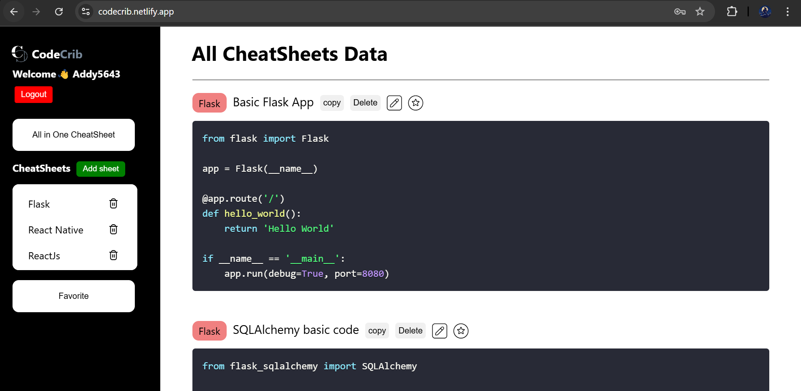
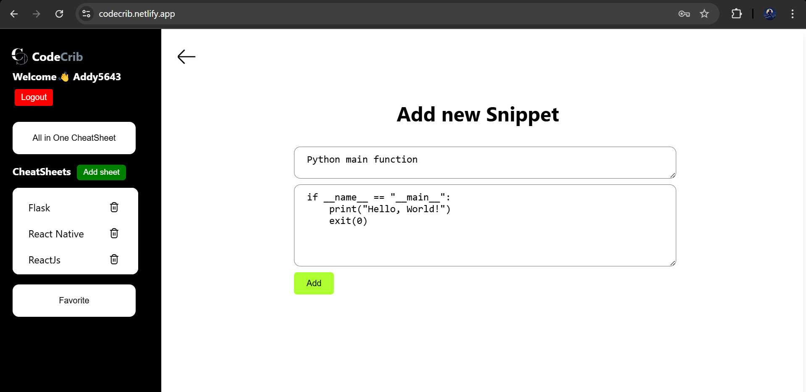

# CodeCrib

Visit [CodeCrib](https://codecrib.netlify.app/)

**CodeCrib** is a web application designed to help developers create, manage, and access cheat sheets for various programming languages and frameworks. Built using **ReactJS** for the frontend and **Flask** for the backend, CodeCrib allows users to create cheat sheets, add custom notes, and organize them for easy access. It's an essential tool for developers who need quick reference guides at their fingertips.

---

## ✨ Features

- **Create Cheat Sheets**: Users can add new cheat sheets with titles, descriptions, and code snippets.
- **Edit and Delete**: Modify or remove cheat sheets at any time.
- **Search Functionality**: Search for cheat sheets by title or content.
- **Responsive Design**: Optimized for desktop and mobile devices.
- **User Authentication** (if implemented): Log in to save and manage cheat sheets securely.
- **Easy-to-Use Interface**: Intuitive UI to quickly create and navigate cheat sheets.

---

## 🛠️ Tech Stack

- **Frontend**: ReactJS, JSX, CSS
- **Backend**: Flask (Python)
- **Database**: SQLite (or another database of your choice, e.g., PostgreSQL)
- **Hosting**: Deployed on [Heroku](https://www.heroku.com), [Netlify](https://www.netlify.com), or any cloud provider

---

## 🖼️ Screenshots

| Homepage | Create Cheat Sheet |
| :---: | :---: |
|  |  |

---

## 🚀 Setup Instructions

### 1. Clone the Repository

```bash
git clone https://github.com/AddyDev555/CodeCrib
cd app
npm run dev